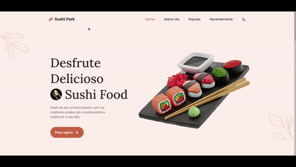

<h1 align="center">
     🍣 <a href="#" alt="website sushi"> Sushi Website </a>
</h1>

<p align="center">


</p>

---

## 💻 Sobre o projeto

🍣 Sushi Park - sua proposta inovadora e todo o desenvolvimento foi pensado para oferecer o melhor aos nossos clientes.


Projeto desenvolvido durante a mentoria **Conquiste sua vaga** oferecido pelo [Pedro Marins](https://conquistesuavaga.com/mentoria).
Conquiste sua vaga é uma experiência online com muito conteúdo prático e desafios que farão você crescer como profissional através de métodos exclusivos.

---

## 🛠 Tecnologias

## Front end


---

## ⚙️ Funcionalidades

- [x] Design de site de restaurante de sushi responsivo usando HTML CSS e JavaScript.
  - [x] Inclui um modo escuro e claro.
  - [x] Rolagem suave em cada seção.
  - [x] Contém animações ao rolar.
  - [x] Desenvolvido primeiro com a metodologia Mobile First, depois para desktop.
  - [x] Compatível com todos os dispositivos móveis e com uma interface de usuário bonita e agradável.
 
---

## 📱 Layout mobile


## 💻 Layout web


---

# Como executar o projeto

```bash
# clonar repositório
git clone https://github.com/Fe7rodrigues/sushi-restaurant
# entre no diretório
cd sushi-restaurant
```

---

Feito com ❤️ por Fernando Rodrigues👋🏽

#  Entre em contato!

<p align="center">
  <a href="mailto:fe7rodrigues@gmail.com" >
    
  </a>   
  
  <a href="https://www.linkedin.com/in/fernando-rodrigues-69251a1a2/" target="_blank">
    
  </a>   
